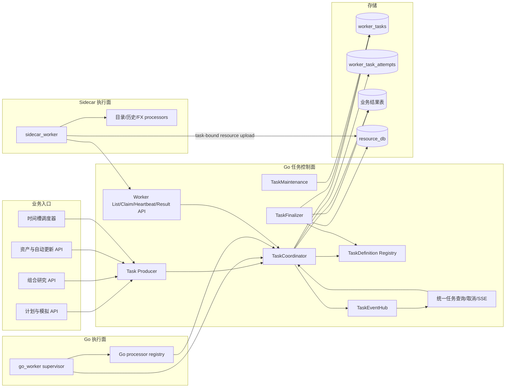
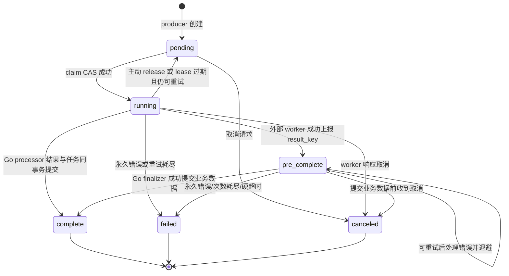
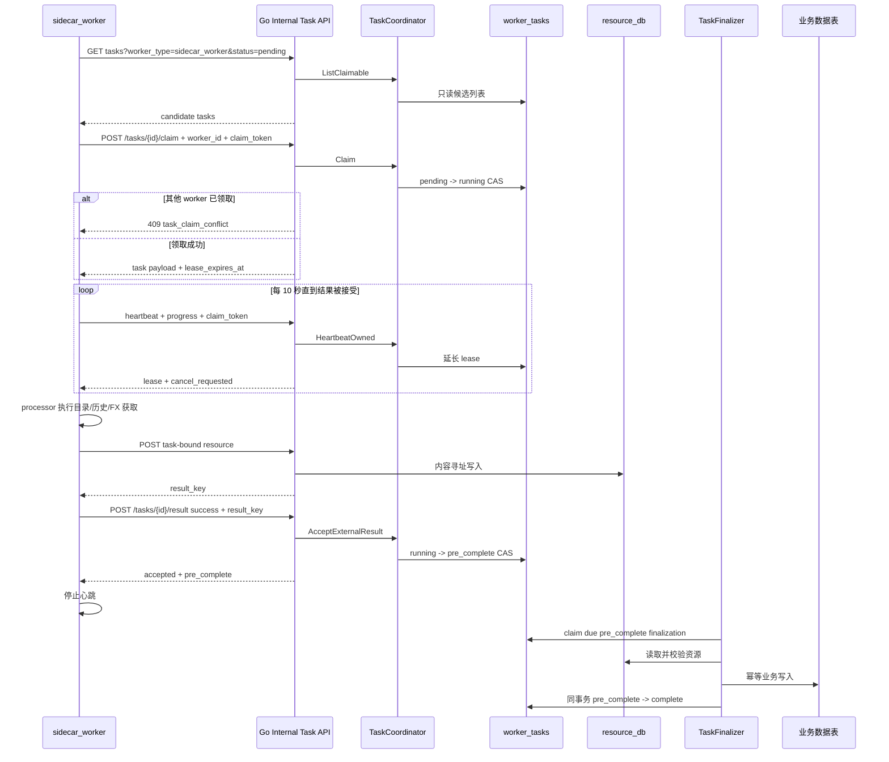
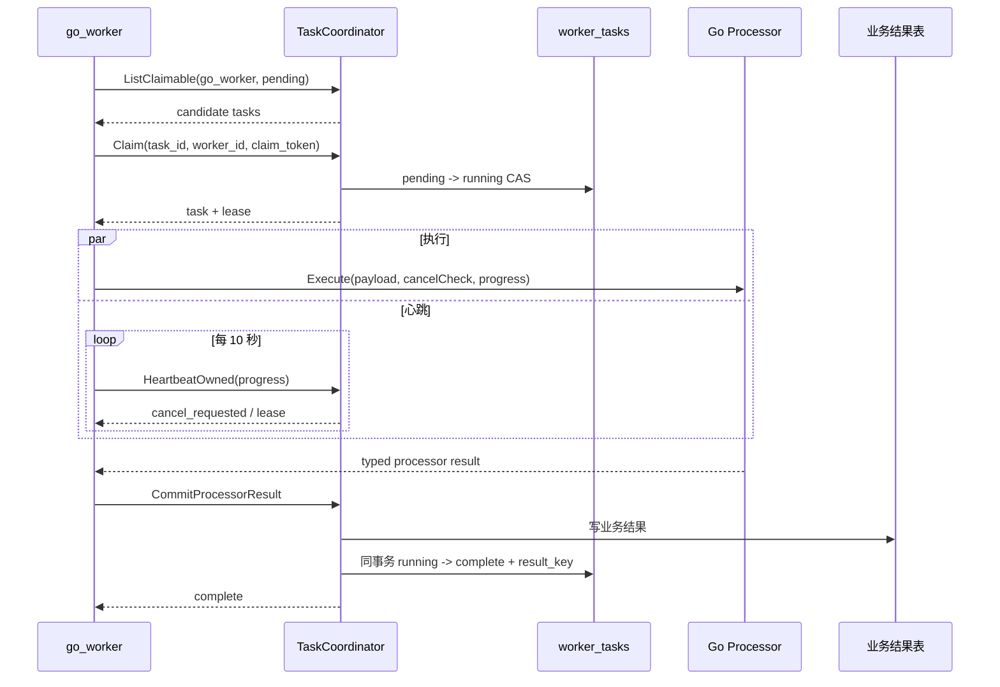

# 统一 Worker Task 任务架构重构方案

- 状态：已实施
- 重构性质：破坏性重构，不兼容 `jobs`、旧 sidecar 直连 SQLite 或旧任务 API
- 唯一任务表：`worker_tasks`
- 当前工程状态：未发布，不迁移历史任务和历史运行结果
- migration 约束：任务重构涉及的 migration 变更只允许 DDL；禁止用 migration 执行任务数据搬迁、回填或修正

## 1. 结论与固定决策

本次重构有必要，并且必须一次完成任务数据模型、控制面、worker 协议和业务结果状态的收敛。只把 `jobs` 行复制到 `worker_tasks`，或者只给 sidecar 增加几个 HTTP 接口，都不能解决当前的双状态机、双恢复器和业务状态分叉问题。

实施后的固定结论如下，后续开发不得再引入平行方案：

1. `worker_tasks` 是系统唯一可领取任务表；删除 `jobs` 表、`JobRepo`、`JobService` 和 `/api/v1/jobs/*`。
2. `worker_type` 表示执行运行时类型，当前只定义 `go_worker` 和 `sidecar_worker`；一条任务只能绑定一个 `worker_type`。
3. 现有 `type` 字段保留原名和原语义，它是 `task_type`，用于在对应 worker 内选择 processor。
4. Go 是唯一任务控制面：创建、查询、claim、心跳、进度、取消、结果上报、结果后处理、过期恢复和终态清理由 Go 负责。
5. sidecar 不再读取或写入 `.dev-data/fireman.db`，删除 Python `TaskDB` 和 `FIREMAN_DB_PATH` 依赖。
6. Go worker 不通过 `localhost` HTTP 回调自己；它直接调用与内部 HTTP handler 相同的 `TaskCoordinator` 服务方法，语义和 CAS 条件完全一致。
7. worker 执行保证为 **at-least-once**；通过 claim token、task id、幂等 processor 和“业务结果 + 任务终态”同事务提交，实现业务层 effectively-once。
8. 业务结果表继续存在，但只保存冻结输入、业务结果和完成时间；任务状态、错误、进度、重试和心跳只从 `worker_tasks` 读取。
9. sidecar 成功结果先进入 `pre_complete`，由 Go finalizer 完成资源读取、业务落库和终态提交；sidecar 在结果被 Go 接受后停止心跳，不再负责 notify 和 post-process 重试。
10. 自动更新扫描改为 `market_data_auto_update_scan` Go 任务；定时器只负责按时间槽幂等创建扫描任务。
11. task janitor、finalizer 扫描和 resource TTL cleanup 是调度基础设施，不包装成 task，避免任务系统故障时无法恢复任务系统自身。
12. 不兼容旧数据：不双写、不复制 `jobs`、不保留旧任务 API。开发数据库按本方案重建，市场数据和运行结果按新任务链路重新生成。

## 2. 当前任务与处理流程盘点

### 2.1 当前两套任务系统

| 体系 | 表 | 状态 | claim/心跳/终态所有者 | 当前执行位置 |
| --- | --- | --- | --- | --- |
| Go 计算任务 | `jobs` | `queued/running/succeeded/failed/canceled` | Go `JobRepo` / `jobs.Worker` | Go 进程 |
| 市场数据任务 | `worker_tasks` | `pending/running/pre_complete/complete/failed/canceled` | sidecar 直接写 SQLite | Python sidecar |

当前 `worker_tasks` 虽然被描述为通用表，但它实际只支持市场数据 sidecar：没有 `worker_type`、claim API、心跳 API、统一结果 API或 Go processor 注册表。当前 sidecar 直接通过 `BEGIN IMMEDIATE` 操作主数据库，并自行运行 stale janitor 和 post-process retry loop。

### 2.2 当前全部可领取任务

| 当前 task type | 当前表 | 生产入口 | 当前执行器 | 业务输入 | 结果位置 |
| --- | --- | --- | --- | --- | --- |
| `simulation` | `jobs` | `POST /plans/:plan_id/simulations` | `SimulationRunner` | `simulation_runs.input_snapshot_json` | `simulation_runs`、path index、quantile series |
| `stress` | `jobs` | `POST /plans/:plan_id/stress-tests` | `AnalysisRunner.RunStress` | `analysis_results.result_json` 中的 pending snapshot | `analysis_results.result_json` |
| `sensitivity` | `jobs` | `POST /plans/:plan_id/sensitivity-tests` | `AnalysisRunner.RunSensitivity` | pending snapshot | `analysis_results.result_json` |
| `research_backtest` | `jobs` | `POST /research/collections/:id/backtests` | `ResearchService.ExecuteBacktestJob` | `research_backtest_runs.input_snapshot_json` | backtest run、points、years、months |
| `research_optimization_backtest` | `jobs` | `POST /research/collections/:id/optimizations` | `ResearchService.ExecuteOptimizationJob` | optimization run snapshot/config | `research_optimization_runs.result_json` |
| `asset_directory_sync` | `worker_tasks` | 资产目录同步、自动更新规则 | sidecar directory executor | `payload_json` | `resource_db` 后由 Go 写 `market_assets` |
| `asset_history_sync` | `worker_tasks` | 资产详情、计划 readiness、研究集合、自动更新 | sidecar history executor | `payload_json` | `resource_db` 后由 Go 写历史、投影、研究指标 |
| `fx_rate_sync` | `worker_tasks` | FX 同步、研究集合缺失数据同步 | sidecar FX executor | `payload_json` | `resource_db` 后由 Go 写系统 FX 数据 |

### 2.3 当前未任务化但属于业务调度的工作

| 工作 | 当前流程 | 本方案处理 |
| --- | --- | --- |
| 自动更新扫描 | `AutoUpdateScheduler` 定时直接调用 `AutoUpdateService.RunOnce`，再创建市场数据任务 | 新增 `market_data_auto_update_scan` / `go_worker` 任务；定时器只负责 enqueue |
| holding simulation snapshot 构建 | 使用已经落库的历史数据同步构建 | 保持同步业务操作，不是远程/后台任务 |
| task stale 扫描 | Go 扫 `jobs`，sidecar 扫 `worker_tasks` | 合并为 Go `TaskMaintenance` |
| sidecar post-process notify/retry | sidecar 扫 `pre_complete` 并回调 Go | 移到 Go `TaskFinalizer` |
| `resource_db` TTL 清理 | Go 定时基础设施任务 | 保持基础设施循环，不进入 `worker_tasks` |
| task 终态记录清理 | 当前没有统一策略 | Go maintenance 按本方案的保留规则执行 |

### 2.4 当前各类任务的实际处理流程

#### Go 计算任务公共流程

当前五类 Go 任务都由业务 service 在事务中创建 `jobs` 和 pending 业务记录。`jobs.Worker` 通过 `ClaimNextQueued` 直接从 SQLite 取最老 queued job，置 running 后按 type 分发。supervisor 每 10 秒写 `jobs.heartbeat_at`，processor 同步执行，最后分别写业务表和 jobs 终态。

- `simulation`：创建时冻结完整 simulation input snapshot 到 run；worker 加载 snapshot，运行 Monte Carlo，事务写 summary、path index、nominal/real quantile series，再把 job 置 succeeded。
- `stress`：创建时把目标 simulation snapshot 包进 pending analysis result；worker 执行预定义压力情景，更新 analysis result，再完成 job。
- `sensitivity`：与 stress 相同，但执行多组参数敏感性计算并更新 analysis result。
- `research_backtest`：创建时冻结 collection、权重、共同窗口、行情/FX source hash；worker 再次校验 source hash，执行历史回测并事务写 points/years/months/summary；run 和 job 分别更新 status。
- `research_optimization_backtest`：创建时冻结 optimization config 和输入；worker 内部再启动固定数量 goroutine 并行评估候选，持续写 job progress 和 optimization evaluated_count，最终写 ranked result；run 和 job 分别更新 status/error。

当前 Go 进程正常退出时尝试把 active job 放回 queued；进程异常退出后依赖启动/周期 orphan recovery。该恢复器只认识 `jobs`，不处理 worker_tasks。

#### sidecar 市场任务公共流程

当前三类 sidecar 任务由 Go 创建 pending `worker_tasks`，但之后的生命周期由 Python 直接操作主 SQLite：

```text
无锁 probe pending
-> BEGIN IMMEDIATE 选择最老任务并 running
-> sidecar heartbeat thread 直接 UPDATE heartbeat_at
-> processor 获取/标准化数据
-> POST /internal/resources 得到 envelope
-> sidecar 直接 UPDATE running -> pre_complete/result_data
-> POST /internal/tasks/:id/post-process
-> sidecar 根据 Go 分类直接 UPDATE complete/failed 或安排重试
```

- `asset_directory_sync`：processor 按 sync unit 拉目录；Go post-process 校验请求类别、来源、覆盖率和版本后 upsert market_assets，并更新 sync state/data version。
- `asset_history_sync`：processor 按冻结的资产身份和 source policy 拉历史；Go post-process 校验 result identity、覆盖率、日期和数值，写 points/history state/detail projection/research metrics。
- `fx_rate_sync`：processor 拉 USDCNY/HKDCNY；Go post-process 校验 pair/日期/值后写系统 FX 数据和版本。

sidecar 另有两个直接写库循环：stale janitor 把超时 running/pre_complete 置 failed；notify loop 扫 due pre_complete 并维护 post_process attempts/backoff。Go 无法统一观察或约束这些状态写入。

#### 自动更新扫描流程

当前 `AutoUpdateScheduler` 启动时立即执行一次，此后按本地时间对齐周期直接调用 `AutoUpdateService.RunOnce`。RunOnce 先 reconcile 规则的 last task 状态，再批量扫描 due rules，为每条规则创建/复用 `asset_directory_sync` 或 `asset_history_sync`，并在 task 创建事务中绑定规则的 last_task_id/next_run_at。扫描本身没有 task id、状态、重试、取消或管理后台执行记录。

### 2.5 当前同一状态的多份存储

下列字段目前会造成任务状态分叉：

- `jobs.status` 与 `research_backtest_runs.status`；
- `jobs.status/error_*` 与 `research_optimization_runs.status/error_*`；
- `worker_tasks.status` 与 sidecar post-process callback 结果；
- `/api/v1/jobs/:id` 与 `/api/v1/tasks/:id` 两套查询接口；
- `/admin/jobs` 与 `/admin/worker-tasks` 两个管理页面；
- `useJobStatus` 与 `useWorkerTaskPolling` 两套前端轮询逻辑。

目标结构必须删除这些重复真相，而不是增加同步代码维持它们。

## 3. 最终任务处理架构

### 3.1 组件与控制面架构



### 3.2 统一任务状态机



### 3.3 sidecar 任务时序



### 3.4 Go worker 任务时序



## 4. 职责边界

### 4.1 Task Producer

Producer 只负责：

- 验证业务请求；
- 冻结输入或创建 pending 业务 run；
- 计算 `input_hash`、`dedupe_key` 和任务优先级；
- 在同一主库事务中创建 `worker_tasks` 与业务 run/规则绑定；
- 返回统一 `task_id`。

Producer 禁止 claim、直接运行 processor、直接改任务终态或自建状态字段。

### 4.2 TaskCoordinator

`TaskCoordinator` 是唯一允许修改 `worker_tasks` 生命周期字段的服务，负责：

- create/reuse；
- list claimable；
- claim/release；
- heartbeat/progress；
- cancel；
- worker failure/result；
- lease recovery；
- finalization scheduling；
- 任务事件发布。

Repository 只提供带状态和 ownership 条件的 CAS 方法，不向业务 service 暴露无条件 `UPDATE worker_tasks`。

### 4.3 Worker

worker 只负责：

- 按自身固定 `worker_type` 列出候选任务；
- 逐个 claim；
- 按 `type` 选择已注册 processor；
- 定期上报心跳和进度；
- 响应 cancel/lease_lost；
- 上报成功结果 key 或分类失败；
- 在结果被接受或 lease 丢失后停止心跳。

worker 不负责 stale 扫描、跨任务清理、修改其他任务或直接操作任务数据库。

### 4.4 Processor 与 Result Handler

- Processor 负责计算或外部数据获取，不拥有任务状态。
- `TaskDefinition` 为每个 `(worker_type, type)` 注册 payload schema、processor、result handler、重试策略、lease 和 completion mode。
- Go processor 返回 typed result，由 result handler 在主库事务中写业务结果并完成任务。
- sidecar processor 上传 resource 后只返回 `result_key`；Go finalizer 读取 resource 并调用 result handler。

## 5. 目标数据模型

### 5.1 `worker_tasks`

目标字段固定如下：

| 字段 | 类型 | 约束与含义 |
| --- | --- | --- |
| `id` | TEXT PK | 统一前缀 `task_` + UUID |
| `version_no` | INTEGER UNIQUE | 由 `worker_task_versions` 分配的全局单调版本 |
| `worker_type` | TEXT NOT NULL | `go_worker` / `sidecar_worker` |
| `type` | TEXT NOT NULL | processor dispatch key，保留现有字段名 |
| `status` | TEXT NOT NULL | `pending/running/pre_complete/complete/failed/canceled` |
| `priority` | INTEGER NOT NULL | 数字越大越先领取；同优先级按创建顺序 |
| `scope_type` | TEXT NOT NULL DEFAULT '' | `plan/research_collection/system/market_asset` 等观测范围 |
| `scope_id` | TEXT NOT NULL DEFAULT '' | 业务范围 id；不设业务 FK |
| `dedupe_key` | TEXT NOT NULL DEFAULT '' | 同类 active task 去重 |
| `input_hash` | TEXT NOT NULL DEFAULT '' | 冻结输入身份 |
| `payload_json` | TEXT NOT NULL | processor 输入；创建后不可修改 |
| `result_key` | TEXT NOT NULL DEFAULT '' | 统一结果定位 key |
| `result_meta_json` | TEXT NOT NULL DEFAULT '{}' | 小型审计元数据，不保存大结果 |
| `progress_current` | INTEGER NOT NULL DEFAULT 0 | 统一进度 |
| `progress_total` | INTEGER NOT NULL DEFAULT 0 | 统一进度总量 |
| `phase` | TEXT NOT NULL DEFAULT '' | processor 阶段 |
| `cancel_requested` | INTEGER NOT NULL DEFAULT 0 | 取消意图 |
| `attempt_count` | INTEGER NOT NULL DEFAULT 0 | 成功 claim 次数 |
| `max_attempts` | INTEGER NOT NULL | 来自 TaskDefinition |
| `available_at` | INTEGER NOT NULL | pending 可领取时间，支持退避 |
| `claimed_by` | TEXT NOT NULL DEFAULT '' | worker instance id |
| `claim_token_hash` | TEXT NOT NULL DEFAULT '' | 当前 attempt 所有权证明 |
| `attempt_started_at` | INTEGER | 当前 attempt 开始时间 |
| `heartbeat_at` | INTEGER | 最后一次服务端心跳时间 |
| `lease_expires_at` | INTEGER | 服务端 lease 截止时间 |
| `finalize_attempts` | INTEGER NOT NULL DEFAULT 0 | Go finalizer 尝试次数 |
| `next_finalize_at` | INTEGER | 下次 finalizer 时间 |
| `error_code` | TEXT NOT NULL DEFAULT '' | 终态或最近恢复错误 |
| `error_message` | TEXT NOT NULL DEFAULT '' | 最大 2000 字符 |
| `created_at` | INTEGER NOT NULL | 创建时间 |
| `started_at` | INTEGER | 首次成功 claim，后续不覆盖 |
| `result_reported_at` | INTEGER | worker 成功结果被接受时间 |
| `pre_completed_at` | INTEGER | 进入 Go 后处理时间 |
| `finished_at` | INTEGER | 终态时间 |
| `updated_at` | INTEGER NOT NULL | 最近状态更新 |

`worker_type` 是路由约束，不是安全认证。内部 API 仍只监听内部地址；claim token 用于 attempt ownership，不能代替未来的 worker 身份认证。

### 5.2 索引与唯一约束

必须创建：

```sql
CREATE INDEX idx_worker_tasks_claim
ON worker_tasks(worker_type, status, available_at, priority DESC, created_at, id);

CREATE INDEX idx_worker_tasks_filter
ON worker_tasks(worker_type, status, created_at DESC, id DESC);

CREATE INDEX idx_worker_tasks_scope
ON worker_tasks(scope_type, scope_id, created_at DESC);

CREATE INDEX idx_worker_tasks_lease
ON worker_tasks(status, lease_expires_at);

CREATE INDEX idx_worker_tasks_finalize
ON worker_tasks(status, next_finalize_at);

CREATE UNIQUE INDEX uq_worker_tasks_active_dedupe
ON worker_tasks(worker_type, type, dedupe_key)
WHERE status IN ('pending', 'running', 'pre_complete') AND dedupe_key <> '';
```

### 5.3 Attempt 审计表

新增 `worker_task_attempts`，每次 claim 插入一行，记录 attempt_no、worker_type、worker_id、claimed_at、last_heartbeat_at、released_at、outcome 和错误。它是 append-only 审计表，不是可领取任务表，不保存当前任务状态。

当前 `post_process_records` 重命名为 `worker_task_finalize_records`，由 Go finalizer 写入。sidecar 不再产生 callback，因此管理后台不再使用“回调记录”概念。

### 5.4 幂等键

`job_idempotency_keys` 替换为业务无关的 `worker_task_idempotency_keys`：

```text
scope_type + scope_id + task_type + idempotency_key -> task_id + input_hash
```

- 同 key、同 input hash：返回原 task；
- 同 key、不同 input hash：返回 `idempotency_conflict`；
- 自动更新扫描使用 `system/auto_update_scan/{slot_timestamp}` 作为幂等键，保证重启不会重复执行同一时间槽。

### 5.5 业务结果表调整

| 当前表 | 目标调整 |
| --- | --- |
| `simulation_runs` | `job_id` 改 `task_id`，FK 指向 `worker_tasks`；状态继续完全从 task join 得出 |
| `analysis_results` | `job_id` 改 `task_id` |
| `research_backtest_runs` | `job_id` 改 `task_id`；删除 `status`，查询时 join task |
| `research_optimization_runs` | `job_id` 改 `task_id`；删除 `status/error_code/error_message`，进度与错误 join task |
| market sync/history state | `last_task_id` 语义保持不变，统一引用新 task id |
| auto update rules | `last_task_id` 语义保持不变 |
| market data versions | 继续记录最终成功 task id/version |

业务 API 可以继续返回 `status/error/progress`，但这些字段必须由 service join `worker_tasks` 后生成，不得重新持久化。

### 5.6 Result key 规范

| task type | result key |
| --- | --- |
| `simulation` | `simulation_run:{run_id}` |
| `stress` | `analysis_result:{task_id}` |
| `sensitivity` | `analysis_result:{task_id}` |
| `research_backtest` | `research_backtest_run:{run_id}` |
| `research_optimization_backtest` | `research_optimization_run:{run_id}` |
| `fire_plan_improvement` | `fire_plan_improvement_run:{run_id}` |
| `market_data_auto_update_scan` | `resource:{sha256}`，内容为 scan summary |
| 三类 sidecar task | `resource:{sha256}` |

结果 key 必须由 Go 校验其前缀和 task type 匹配，不能由客户端用任意字符串关联业务记录。

### 5.7 默认 scope、priority 与 dedupe

| type | scope | priority | active dedupe key |
| --- | --- | ---: | --- |
| `simulation` | `plan/{plan_id}` | 100 | 空；HTTP idempotency 单独处理 |
| `stress` / `sensitivity` | `plan/{plan_id}` | 100 | `{type}|simulation_run:{run_id}`，supersede 前一任务 |
| `research_backtest` | `research_collection/{id}` | 100 | `research_backtest|collection:{id}|input:{hash}` |
| `research_optimization_backtest` | `research_collection/{id}` | 100 | `research_optimization|collection:{id}|input:{hash}` |
| 手工三类市场任务 | `system` 或 `market_asset/{asset_key}` | 100 | 保持现有 sync dimension key |
| `market_data_auto_update_scan` | `system/auto_update` | 50 | `auto_update_scan|slot:{epoch_ms}` |
| scan 创建的市场子任务 | 对应目录或资产 | 20 | 与手工任务相同，确保互相复用 |

同 dedupe key 的手工任务已经 active 时，自动扫描必须复用它，不能因为 priority 或来源不同再创建一条。

## 6. TaskDefinition 注册表

新增集中注册表，禁止在 worker 中继续使用分散的 switch：

| worker_type | type | completion mode | max attempts | processor/result handler |
| --- | --- | --- | ---: | --- |
| `go_worker` | `simulation` | direct transaction | 2 | Monte Carlo processor |
| `go_worker` | `stress` | direct transaction | 2 | stress processor |
| `go_worker` | `sensitivity` | direct transaction | 2 | sensitivity processor |
| `go_worker` | `research_backtest` | direct transaction | 2 | research backtest processor |
| `go_worker` | `research_optimization_backtest` | direct transaction | 2 | optimization processor |
| `go_worker` | `fire_plan_improvement` | direct transaction | 2 | FIRE 计划改善搜索 processor |
| `go_worker` | `market_data_auto_update_scan` | direct transaction | 2 | auto-update scan processor |
| `sidecar_worker` | `asset_directory_sync` | Go finalizer | 2 | directory result handler |
| `sidecar_worker` | `asset_history_sync` | Go finalizer | 2 | history result handler |
| `sidecar_worker` | `fx_rate_sync` | Go finalizer | 2 | FX result handler |

每个定义必须包含：payload decoder/validator、result decoder/validator、lease duration、retry classifier、initial progress total、result key validator 和可选 finalizer。

当前所有类型统一采用：心跳间隔 10 秒、lease 60 秒、maintenance 扫描 15 秒。processor 可以声明更长 lease，但不能关闭心跳。

## 7. 统一 API 契约

### 7.1 Worker 内部 API

所有接口位于仅内部监听器的 `/internal/worker-tasks`：

| 方法与路径 | 用途 |
| --- | --- |
| `GET /internal/worker-tasks` | 按 `worker_type/status/types/limit/cursor` 拉候选或状态列表 |
| `GET /internal/worker-tasks/:id` | 拉取单任务状态；payload 只对匹配 worker_type 返回 |
| `POST /internal/worker-tasks/:id/claim` | claim 指定 pending task |
| `POST /internal/worker-tasks/:id/heartbeat` | 上报心跳、进度和 phase |
| `POST /internal/worker-tasks/:id/release` | worker 关闭或无法执行时主动释放 |
| `POST /internal/worker-tasks/:id/resources` | 绑定 task/claim 的资源上传，返回 result key |
| `POST /internal/worker-tasks/:id/result` | 上报成功、失败或取消结果 |

原 `/internal/resources` 和 `/internal/tasks/:id/post-process` 删除。

### 7.2 List 语义

请求示例：

```http
GET /internal/worker-tasks?worker_type=sidecar_worker&status=pending&limit=20
```

- `worker_type`、`status` 必填；claim 流程只允许 `status=pending`。
- `types` 可选，用于声明该 worker 实例当前加载的 processor；服务端验证它们均属于该 worker_type。
- 默认 limit 20，最大 100。
- cursor 使用不透明编码，内部包含 `priority/created_at/id`；禁止 offset claim paging。
- list 是只读快照，不产生 reservation，也不返回“已领取”假象。
- worker 按列表顺序逐个 claim；409 后立即尝试下一项，不把冲突记录为任务失败。

### 7.3 Claim 语义

请求：

```json
{
  "worker_type": "sidecar_worker",
  "worker_id": "sidecar_worker:host-a:process-uuid",
  "claim_token": "client-generated-128-bit-random-token"
}
```

claim 必须执行单条 CAS：

```text
id 匹配
worker_type 匹配
status = pending
available_at <= server_now
cancel_requested = false
attempt_count < max_attempts
```

成功后 `attempt_count+1`，写 claimed_by/token hash/heartbeat/lease，并返回完整 payload。冲突统一返回 HTTP 409 `task_claim_conflict` 和当前 status；类型不匹配返回 403 `task_worker_type_mismatch`。

相同 task、worker_id、claim_token 的重复 claim 是幂等成功；不同 token 对 running task 必须冲突。

### 7.4 Heartbeat 与进度

请求包含 worker_id、claim_token、`progress_current`、`progress_total`、`phase`。Go 使用服务端时间延长 lease。

- ownership CAS 未命中：409 `task_lease_lost`，worker 必须立即中止且不得上报结果；
- progress_current 只能单调增加；
- total 一旦从 0 变为正数不得减小；
- phase 最大 64 字符；
- 响应包含 `lease_expires_at` 与 `cancel_requested`；worker 收到取消后停止 processor 并上报 canceled。

### 7.5 Resource 上传

保留当前 gzip、SHA-256、schema version 和 128 MiB 限制，但上传改为 task-bound：

- path 中必须有 task id；
- header 必须带 worker_id 与 claim_token；
- Go 先验证 running ownership，再写 resource_db；
- 返回 `resource:{sha256}`；
- 相同内容重复上传幂等；
- 上传成功但未上报 result 的孤儿资源由 7 天 TTL 清理。

`resourcedb.DB` 新增 `ReadByKey`/`EnvelopeByKey`：Go 可按 SHA-256 key 从 resource_db 自身恢复 content type、encoding、schema、size 和 checksum，不再依赖 `worker_tasks.result_data` 保存 envelope。接受 result 时 Go 把经过 resource_db 校验的摘要写入 `result_meta_json` 供审计。

### 7.6 Result 上报

成功请求：

```json
{
  "worker_id": "sidecar_worker:host-a:process-uuid",
  "claim_token": "...",
  "outcome": "success",
  "result_key": "resource:sha256"
}
```

失败请求：

```json
{
  "worker_id": "...",
  "claim_token": "...",
  "outcome": "failed",
  "retryable": false,
  "error_code": "source_unavailable",
  "error_message": "..."
}
```

- sidecar success：`running -> pre_complete`，响应成功后停止心跳；
- Go direct success：result handler 写业务结果并将 `running -> complete` 放在同一主库事务；
- retryable failure 且仍有 attempt：退避后回 `pending`；
- permanent failure 或次数耗尽：`failed`；
- 同 claim token、同 outcome/result key 的重复上报返回当前状态，保证响应丢失后的安全重试；
- 同 claim token 但不同 result key 返回 409 `task_result_conflict`。

取消与成功结果并发时固定采用数据库提交顺序：success CAS 必须带 `cancel_requested=0`；取消先提交则 success 返回 `task_cancel_requested`，worker 随后上报 canceled；success 先进入 pre_complete 后，取消可以在 finalizer 写业务数据前将其转 canceled。complete 之后的取消返回 `task_already_terminal`。

### 7.7 公共任务 API

统一替换旧 jobs/tasks 接口：

```text
GET  /api/v1/tasks/:task_id
GET  /api/v1/tasks/:task_id/events
POST /api/v1/tasks/:task_id/cancel
GET  /api/v1/tasks?worker_type=&type=&status=&scope_type=&scope_id=&limit=&offset=
```

公共接口不返回 payload_json、claim token hash 或 result resource 原文。业务创建接口统一返回：

```json
{
  "task_id": "task_...",
  "status": "pending",
  "run_id": "可选业务 run id",
  "reused": false
}
```

### 7.8 固定错误码

至少实现：

```text
task_not_found
task_claim_conflict
task_worker_type_mismatch
task_lease_lost
task_already_terminal
task_cancel_requested
task_payload_invalid
task_type_unsupported
task_result_key_invalid
task_result_conflict
task_retry_exhausted
worker_heartbeat_timeout
task_finalize_timeout
task_finalize_failed
```

## 8. 各任务改造方案

### 8.1 `simulation`

- producer 在同一事务创建 `worker_tasks(go_worker/simulation)` 与 `simulation_runs(task_id)`。
- payload 只保存 `run_id`；冻结输入继续只存 run 表，避免复制大 JSON。
- processor 加载 snapshot、运行 Monte Carlo，将 summary/path/quantiles 作为 typed result 返回。
- result handler 在一个事务中替换所有输出并完成 task。
- 查询 simulation 时 join task 得到状态、进度和错误。
- pruning 删除 run 及子结果；不直接删除 task，交由 terminal retention 清理。

### 8.2 `stress` / `sensitivity`

- `analysis_results.task_id` 是唯一业务关联。
- supersede 逻辑改为调用 TaskCoordinator：pending 立即 cancel，running 设置 cancel_requested。
- processor 不直接修改 task；result handler 更新 result_json 并完成 task。
- cancel 或失败不再向 analysis_results 写第二份状态。

### 8.3 `research_backtest`

- 删除 run.status；活动/完成/失败都 join task。
- `FindSucceededRunByInputHash` 改为 join `worker_tasks.status='complete'`。
- active 去重由 task dedupe key `research_backtest|collection:{id}|input:{hash}` 保证。
- processor 不再调用 MarkRunRunning/FailRun；进度和错误只写 task。
- points/years/months 与 task complete 同事务提交。

### 8.4 `research_optimization_backtest`

- 删除 optimization run 的 status/error 字段。
- `evaluated_count` 的实时值使用 task progress_current；最终 result 内保留审计计数。
- processor 的内部 4 worker 候选并发保持不变，它们是单个 task 内部并行，不是任务 claim worker。
- 最终 ranked result 与 task complete 同事务提交。
- 进程重启后的自动重试沿用冻结 input snapshot，从头重新枚举；不承诺从 candidate offset 断点续跑。

### 8.5 `asset_directory_sync`

- producer 固定 `worker_type=sidecar_worker`。
- sidecar 只通过 API claim/heartbeat/upload/result。
- result 上报进入 pre_complete；Go finalizer 保留现有覆盖率、版本和幂等校验。
- 目录业务提交与 task complete 同事务。

### 8.6 `asset_history_sync`

- payload、source fallback、canonical fund identity 和数据质量规则保持不变。
- Go finalizer 继续更新 points、history state、detail projection、research metrics 和 snapshot 可用状态。
- 所有成功业务写入和 task complete 同事务；部分基金失败只影响自身 task。

### 8.7 `fx_rate_sync`

- 与 history 使用同一 sidecar 协议。
- resource result 由 Go 校验 pair、日期、数值与 source 后提交。
- market data version 和 task complete 同事务。

### 8.8 `market_data_auto_update_scan`

- 调度器每个扫描时间槽只创建一条 `go_worker` task，不直接执行 `RunOnce`。
- task priority 固定 50；手工交互任务 100；扫描产生的自动市场任务 20。
- processor 扫 due rules，并在每条规则事务中创建/复用 sidecar 子任务和绑定 last_task_id。
- processor 输出 `{candidates, created, reused, failed}` summary resource，并完成 scan task。
- 单条规则创建失败记录到规则本身，不阻断其他规则；扫描器基础设施错误才使 scan task retry/fail。

## 9. 过期恢复、取消与清理

### 9.1 TaskMaintenance 固定参数

```text
heartbeat interval       = 10s
lease duration           = 60s
maintenance scan         = 15s
max execution attempts   = 2
finalize max attempts    = 10
finalize max backoff     = 300s
pre_complete hard timeout= 1h
resource TTL             = 7d
finalize records TTL     = 30d
unreferenced terminal task TTL = 90d
```

### 9.2 启动恢复

- `go_worker` 与 backend 同进程：backend 启动时所有 `running/go_worker` 均属于旧进程，立即按 attempt_count requeue 或 fail，不等待 lease。
- `sidecar_worker` 是独立进程：backend 重启不能假定 sidecar 已退出，只恢复 lease 已过期的任务。
- `pre_complete` 不依赖原 worker，Go 启动后立即扫描 due finalization。

### 9.3 周期恢复

对 lease 已过期的 running task，在事务中再次校验 status、token hash 和 lease：

1. cancel_requested：转 canceled；
2. attempt_count < max_attempts：清 owner/lease/progress，按退避回 pending；
3. attempt_count >= max_attempts：转 failed，错误 `worker_heartbeat_timeout`；
4. CAS 未命中说明心跳或终态已先提交，maintenance 不做任何覆盖。

finalizer 并发同样使用 reservation CAS：扫描到 due pre_complete 后，先把 `next_finalize_at` 推迟一个 60 秒 reservation lease 并递增 finalize_attempts，只有 RowsAffected=1 的实例可以处理。实例中断后任务在 reservation 到期时重新可见；业务 result handler 的 version gate 和主库事务保证重复处理安全。

### 9.4 Graceful release

Go worker 和 sidecar 在正常 shutdown 时调用 release：

- 有剩余 attempt：running -> pending，不等待 lease；
- 已取消：running -> canceled；
- 已耗尽：running -> failed；
- release 只接受当前 ownership token。

### 9.5 终态记录保留

90 天后仅删除未被以下对象引用的 terminal task：业务 run、market sync/history state、auto update rule、market data version、idempotency key。被业务结果引用的 task 与结果同生命周期保留。版本号分配表永不回退。

## 10. Go 代码设计

### 10.1 新模块

```text
internal/task/
  model.go                 # 状态、worker type、错误码、API DTO
  registry.go              # TaskDefinition 注册
  coordinator.go           # 唯一生命周期服务
  retry.go                 # retry/backoff 分类
  events.go                # TaskEventHub

internal/repository/
  worker_task.go           # CAS、查询、claim、lease、finalize
  worker_task_attempt.go   # attempt 审计

internal/worker/
  supervisor.go            # go_worker list/claim/heartbeat/release
  maintenance.go           # stale/cancel/retention
  finalizer.go             # pre_complete 后处理
  processors/
    simulation.go
    stress.go
    sensitivity.go
    research_backtest.go
    research_optimization.go
    auto_update_scan.go

internal/api/
  task_handlers.go
  internal_task_handlers.go
```

### 10.2 删除或重命名

- 删除 `internal/repository/jobs.go`；
- 删除 `internal/service/job_service.go`；
- `internal/jobs` 的 supervisor、event hub、runner 移入上述新模块；
- 删除 admin job service、handler、前端 page 和 API types；
- `PostProcessService` 重构为 registry result handler + `TaskFinalizer`；
- 禁止任何 service 直接执行 `UPDATE worker_tasks`。

### 10.3 CAS repository 方法

Repository 至少提供：

```text
CreateTx
FindActiveByDedupeTx
ListByWorkerTypeAndStatus
Claim
HeartbeatOwned
ReleaseOwned
AcceptExternalResultOwned
CompleteOwnedTx
FailOrRetryOwned
RequestCancel
CancelPending
ListExpiredRunning
ConvergeExpired
ListDueFinalize
ReserveFinalizeAttempt
CompleteFinalizeTx
ScheduleFinalizeRetry
ListTerminalForRetention
```

每个 mutation 测试必须断言 RowsAffected；禁止“UPDATE 成功但 0 行也当成功”。

## 11. Sidecar 改造

### 11.1 删除内容

- 删除 `worker/taskdb.py`；
- 删除 SQLite 依赖、WAL/busy_timeout 和 `FIREMAN_DB_PATH`；
- 删除 sidecar janitor thread；
- 删除 pre_complete notify thread；
- 删除直接 mark running/pre_complete/complete/failed SQL。

### 11.2 新客户端流程

`GoInternalClient` 增加 list、get、claim、heartbeat、release、task-bound upload 和 result 方法。runner 使用 process-level worker_id，task attempt 使用随机 claim_token。

claim loop 固定流程：

```text
list pending -> 逐项 claim -> claim 成功后启动 heartbeat -> processor
-> upload resource -> result success -> 收到 accepted -> 停 heartbeat
```

processor 抛出的错误必须映射为 `{error_code, error_message, retryable}`；未知异常使用 `worker_internal_error/retryable=true`。

worker list 和 claim 采用带抖动的退避轮询，避免多个 sidecar 同时空转请求。

## 12. 前端与管理后台

### 12.1 统一任务页面

- 保留 `/admin/worker-tasks` 路径，但标题改为“任务管理”，展示所有 worker_type。
- 删除 `/admin/jobs` 页面与导航。
- 筛选项：worker type、task type、status、scope、task id/dedupe key。
- 列表显示：worker type、task type、scope、status、attempt、progress、phase、claimed_by、heartbeat/lease、duration、error。
- detail drawer 展示 payload、result key、attempt timeline、finalize records 和关联业务结果链接。
- “回调记录”页面改为“结果处理记录”，读取 finalize records。

### 12.2 统一前端任务客户端

- `getJob/cancelJob/subscribeJobEvents` 与 `getTask` 合并为 `getTask/cancelTask/subscribeTaskEvents`。
- 删除 `useJobStatus` 和 `useWorkerTaskPolling`，新增单一 `useTaskStatus`。
- active status 统一为 `pending/running/pre_complete`。
- 所有创建响应和页面 props 从 `job_id` 改为 `task_id`。
- 页面状态文案按 task type 定制，但判断逻辑只使用统一 status。

## 13. 数据库与开发数据处理

本项目尚未发布，本次固定采用 clean-schema 路线，不实施兼容迁移：

1. 修改 schema 定义，使 `worker_tasks` 在所有业务 run 表之前创建。
2. 删除 `jobs` 与 `job_idempotency_keys` 定义。
3. 将业务 run 外键和列统一改为 `task_id -> worker_tasks(id)`。
4. 将最终 schema 收敛到唯一的 `migrations/0001_init.sql`，migration 只允许 DDL。
5. 不写 `INSERT ... SELECT jobs -> worker_tasks`，不保留旧 status 映射代码。
6. 停止本地服务，备份后删除并重建 `.dev-data/fireman.db` 与 resource DB；市场目录和历史通过新 sidecar task 重新拉取。
7. 测试库始终从空库执行完整 schema，确保不存在旧表依赖。

该策略明确接受丢弃当前开发库中的任务、模拟结果、研究回测结果和市场缓存；不把开发数据迁移作为实施前置条件。

### 13.1 Schema 文件改造清单

不新增承载数据搬迁的 migration，直接重写未发布基线中与任务相关的 DDL：

| 文件 | 固定修改 |
| --- | --- |
| `migrations/0001_init.sql` | 包含最终完整 schema：worker task、市场数据、模拟、研究、管理与自动更新相关表及索引 |

首次生产发布前 migration 数量固定为 1，不保留 no-op 编号文件。内置业务数据由 `internal/bootstrap` 初始化。

## 14. 分阶段实施顺序

### Phase 1：目标 schema 与核心 repository

- 完成 worker_tasks 新字段、索引、attempt/finalize/idempotency 表；
- 修改所有业务结果表 task FK；
- 实现纯 repository CAS 测试；
- 暂不启动任何 worker。

通过门槛：空库 migration、schema contract、claim concurrency tests 全部通过。

### Phase 2：TaskCoordinator 与统一 API

- 实现 registry/coordinator/public/internal API/EventHub；
- 实现 cancel、claim token、heartbeat、result idempotency；
- 添加 API contract tests。

通过门槛：两个并发 claim 只有一个成功；错误 worker_type、token、result key 均被拒绝。

### Phase 3：Go maintenance 与 finalizer

- 实现启动恢复、周期 lease 扫描、finalize retry 和 retention；
- 将现有市场数据 post-process handler 接入 registry；
- task terminal 与业务 post-process 同事务。

通过门槛：sidecar 尚未改造前，通过 fake worker 完成三类市场任务的完整生命周期测试。

### Phase 4：Sidecar 切换

- 删除 TaskDB、janitor、notify；
- 使用新 API 客户端；
- 改写 Python worker tests；
- 更新 README、compose 和配置。

通过门槛：sidecar 进程对主 SQLite 文件没有打开权限仍能完成目录、历史和 FX task。

### Phase 5：Go 计算任务逐类切换

按 `stress -> sensitivity -> simulation -> research_backtest -> research_optimization_backtest` 顺序接入。每切一类即删除其 JobRepo 分支和重复 run status 写入，不允许阶段性双写。

通过门槛：每类 producer、processor、result transaction、cancel、retry 和查询 E2E 通过。

### Phase 6：自动更新扫描任务化

- 时间槽 scheduler 只 enqueue；
- scan processor 创建 sidecar 子任务；
- 管理页面可追踪 scan task 和子任务。

通过门槛：重启补扫同一时间槽只产生一个 scan task；规则任务不重复。

### Phase 7：删除旧体系并统一 UI

- 删除 jobs 表代码、API、admin 页面、hooks 和 types；
- 全仓 `rg` 确认无生产代码访问 jobs；
- 统一所有 `job_id` 为 `task_id`。

通过门槛：代码和 schema 均只有 worker_tasks 一套生命周期。

### Phase 8：开发库重建与现场验收

- 重建 `.dev-data`；
- 依次执行目录、历史、模拟、分析、研究回测和调优；
- 执行故障注入；

## 15. 自动化验证矩阵

### 15.1 Repository/Coordinator 单元测试

1. worker_type + status list 只返回匹配任务。
2. list 不改变任务状态。
3. 20 个并发 claim 同一任务只有一个成功。
4. 同 worker/token 重试 claim 幂等；不同 token 冲突。
5. sidecar_worker 不能 claim go_worker task，反之亦然。
6. heartbeat 必须匹配 owner/token/status，且进度不能回退。
7. lease 延长只使用服务端时间。
8. success result 同 key 幂等，不同 key 冲突。
9. retryable failure requeue，permanent failure fail，次数耗尽 fail。
10. pending/running/pre_complete/terminal cancel 分支符合状态机。
11. active dedupe 按 worker_type + type + dedupe_key 生效。
12. task result handler 回滚时 task 不得 complete。

### 15.2 Maintenance/故障测试

1. backend 重启立即恢复全部 running go_worker task。
2. backend 重启不误杀 lease 未过期的 sidecar_worker task。
3. lease 到期后最多 15 秒进入 retry/fail。
4. 心跳与 janitor 并发时，事务内 CAS 防止误回收。
5. release 可立即 requeue。
6. pre_complete retry 采用 2/4/8... 秒退避，上限 300 秒。
7. finalizer 第 10 次或 1 小时硬超时后 fail。
8. 终态 retention 不删除任何仍被业务表引用的 task。

### 15.3 Processor 集成测试

每个 task type 都必须覆盖：成功、业务校验失败、取消、进程中断后重试、结果事务失败回滚、查询状态与结果关联。

市场数据额外覆盖：

- resource 上传成功后结果请求超时，再次上报同 key 不重复写数据；
- upload 后 worker 崩溃，task lease 到期恢复，孤儿 resource 最终被 TTL 清理；
- 三类 post-process 的 version gate 仍可重入；
- 单资产失败不影响同批其他资产任务。

### 15.4 Sidecar 测试

- 默认 pytest 禁止真实网络并 mock 全部 Go task API；
- Python 包中不得 import sqlite3 用于 task 生命周期；
- list 后 claim conflict 会继续下一项；
- heartbeat lease lost 会中止 processor 且不上报结果；
- result 请求失败时保持心跳并重试；
- accepted 后停止心跳；
- shutdown 调用 release。

### 15.5 API 与前端测试

- public task get/cancel/events；
- internal list/claim/heartbeat/resource/result；
- admin worker_type/type/status/scope 分页；
- 所有模拟、研究和市场页面使用 `task_id`；
- 同一 hook 正确处理 pending/running/pre_complete/complete/failed/canceled；
- 管理后台不再出现独立 jobs 页面。

## 16. 现场验收流程

### 16.1 基础结构

```bash
sqlite3 .dev-data/fireman.db ".tables"
sqlite3 .dev-data/fireman.db "PRAGMA foreign_key_check;"
rg -n "FROM jobs|INTO jobs|UPDATE jobs|JobRepo|/api/v1/jobs" internal web sidecars
```

验收：不存在 `jobs` 表和生产引用；所有 run 的 `task_id` 均可关联 worker_tasks；foreign_key_check 无输出。

### 16.2 Sidecar 无数据库权限验收

启动 sidecar 时不挂载 fireman.db，仅配置 Go internal API。执行：目录同步、单资产历史同步、FX 同步。三类 task 必须完整经历：

```text
pending -> running -> pre_complete -> complete
```

并在管理后台看到 worker_id、attempt、心跳、result key 和 finalizer 记录。

### 16.3 Claim 冲突验收

启动两个 sidecar 实例，对同一 pending task 同时 claim。只允许一个 200；另一个收到 409 后领取其他任务。业务数据只能提交一次。

### 16.4 Go 任务验收

逐项运行：

1. FIRE 模拟；
2. 压力测试；
3. 敏感性分析；
4. 研究组合回测；
5. 研究组合调优。

每项必须在统一任务页可见，业务结果页状态必须与 `/api/v1/tasks/:id` 一致，且业务表没有独立 status/error 真相。

### 16.5 故障注入验收

1. 运行 simulation 时 kill backend，重启后任务自动重试并最终 complete；第二次中断后 failed。
2. sidecar claim 后 kill sidecar，75 秒内任务进入 pending 或 failed。
3. resource 上传后、result 上报前 kill sidecar，task 可恢复且不会错误 complete。
4. result 响应发送前断开连接，重试相同 result key 不重复落库。
5. finalizer 写库时制造 SQLite busy，task 保持 pre_complete 并退避重试。
6. running task 取消后，heartbeat 返回 cancel_requested，processor 停止并收敛 canceled。

### 16.6 全量回归命令

```bash
go test ./...
cd web && npm run lint
cd web && npm run test:ci
cd web && npm run build
cd sidecars/market-provider && uv run pytest
```

所有命令必须通过，且 pytest 不允许访问真实网络。

## 17. 完成定义

只有同时满足以下条件才算统一任务架构验收完成：

- 数据库只有 `worker_tasks` 一套可领取任务生命周期；
- 所有 task type 都在 TaskDefinition registry 注册，并具备对应 processor/finalizer 契约；
- sidecar 无主数据库访问能力；
- Go 与 sidecar 均使用 list -> claim -> heartbeat -> result/release 协议；
- Go 统一处理 stale、取消、finalize 和 retention；
- 业务 run 状态只从 worker_tasks 派生；
- 统一公共任务 API、SSE、前端 hook 和管理页面已上线；
- 不存在双写、旧 jobs API、旧 sidecar TaskDB 或兼容状态映射；
- 空库 schema、故障恢复、Go/Web/Python 协议测试覆盖本文定义的状态机与一致性不变量。

## 18. 实现映射与验证契约

### 18.1 实现落点

第 3 节 Mermaid 图即本次落地后的最终任务处理架构。实际代码职责固定如下：

| 职责 | 实现 |
| --- | --- |
| 生命周期、ownership、lease、重试、取消、结果接收 | `internal/task/Coordinator` |
| 9 类任务的 worker/completion/lease/retry/payload/result 定义 | `internal/task/Registry` |
| Go list/claim/heartbeat/processor/release | `internal/worker/Supervisor`、`ProcessorSet` |
| stale recovery、finalizer reservation、retention | `internal/worker/Maintenance`、`service.TaskFinalizer` |
| sidecar list/claim/heartbeat/upload/result/release | `worker/goclient.py`、`worker/runner.py` |
| 公共查询、取消、SSE | `/api/v1/tasks`、`useTaskStatus` |
| 内部 worker 协议 | `/internal/worker-tasks` |
| 统一观测 | `/admin/worker-tasks`、`/admin/finalizations` |

Go processor 与 Go finalizer 均由 map 注册，不存在按任务类型分散执行的 `switch`；启动时会将 handler 集合与 `TaskDefinition Registry` 做全量一致性校验，缺少或多出 handler 会直接启动失败。

### 18.2 任务结果契约

| task type | 状态链/result key | 业务提交条件 |
| --- | --- | --- |
| `simulation` | `pending -> running -> complete`；`simulation_run:{run_id}` | run、路径和 task 终态在同一业务提交中收敛 |
| `stress` | `pending -> running -> complete`；`analysis_result:{task_id}` | 冻结输入对应的 analysis result 已持久化 |
| `sensitivity` | 同上 | 冻结输入对应的 analysis result 已持久化 |
| `research_backtest` | `pending -> running -> complete`；`research_backtest_run:{run_id}` | points、months、summary 与 run 终态一致 |
| `research_optimization_backtest` | `pending -> running -> complete`；`research_optimization_run:{run_id}` | 候选结果与 optimization run 终态一致 |
| `fire_plan_improvement` | `pending -> running -> complete`；`fire_plan_improvement_run:{run_id}` | 改善 result 与 task 终态同事务，输入快照保持冻结 |
| `market_data_auto_update_scan` | `pending -> running -> complete`；`resource:{sha256}` | summary resource 存在，幂等键绑定唯一时间槽 |
| `asset_directory_sync` | `pending -> running -> pre_complete -> complete` | 目录、sync state、data version 和 finalize record 同步提交 |
| `asset_history_sync` | 同上 | points、详情投影、data version 幂等提交 |
| `fx_rate_sync` | 同上 | FX points、data version 和 finalize record 同步提交 |

### 18.3 故障与并发不变量

- 并发 claim 只能有一个成功者，失败者不得获得 owner/token；
- lease 到期后，旧 worker 即使在 maintenance 扫描前也不能续租、上传或提交结果；
- graceful release 必须立即 requeue，并清空 owner、token 和 lease；
- backend 启动恢复 Go worker 任务，但不得误回收 lease 未过期的 sidecar 任务；
- 业务事务回滚时 task 不得错误进入 complete；
- finalizer reservation 只能由一个实例持有，达到次数或硬超时必须进入 failed；
- sidecar 在 result 被接受前保持心跳，lease lost 后丢弃结果；
- 公共 task hook 必须统一处理 `pending/running/pre_complete/complete/failed/canceled`。

### 18.4 Schema 与回归要求

- 空库只应用 `migrations/0001_init.sql`，不存在 `jobs` 表，`PRAGMA foreign_key_check` 无结果；
- 业务任务 ID 由生产 producer 生成，并通过 `task_id` 关联业务结果；业务表不维护平行任务状态；
- 回归范围包含 Go coordinator/processor、Web task 状态、sidecar worker 协议和故障注入；
- sidecar 测试禁止真实网络访问；
- 生产代码不得重新出现 `JobRepo`、`/api/v1/jobs`、sidecar `TaskDB`、主库 `sqlite3` 或 `FIREMAN_DB_PATH` 依赖。
