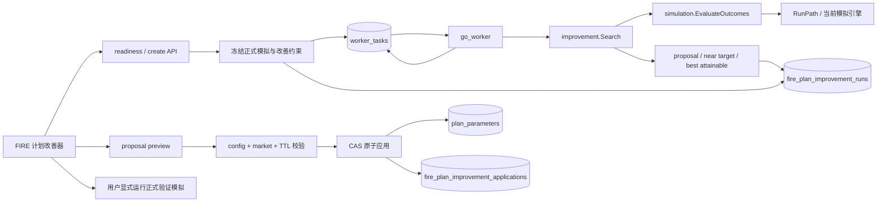

# FIRE 计划改善器

- 状态：已实施
- 算法版本：`fire_plan_improver_v1`
- 适用范围：当前正式 FIRE 模拟未稳健达到用户目标时，搜索可执行的现金流改善方案
- 任务类型：`go_worker / fire_plan_improvement`

## 1. 定位与边界

FIRE 计划改善器回答的问题是：在不修改资产、权重、收益假设和风险模型的前提下，用户需要对可控现金流做多大调整，才能让计划的模拟成功率下界达到目标。

v1 只允许四个杠杆：

1. 推迟 FIRE 年龄；
2. 增加工作期年净储蓄；
3. 降低退休后年支出；
4. 增加可确认的退休稳定年收入。

改善器不优化预期收益、资产权重、通胀、提款规则或税率，不把结果描述为保证成功，也不自动修改计划或启动验证模拟。资产配置优化继续由组合研究承担；改善器只处理人生计划中的可控现金流。

## 2. 达标口径

目标范围为 `[50%, 99%]`，默认 90%。唯一达标口径是来源路径样本的 95% Wilson 区间下界：

```text
success_wilson_low >= target_success_probability
```

点估计达到、Wilson 下界未达到的候选只能显示为“接近目标”，不能成为可应用 proposal。这样可以避免把有限 Monte Carlo 路径中的抽样波动误报为稳健改善。

## 3. 来源模拟与可比性

改善任务必须绑定一个满足以下条件的正式模拟：

- task 已 `complete`；
- 使用当前 `simulation.EngineVersion`；
- config hash 与计划当前有效配置一致；
- market snapshot hash 与当前持仓、模拟快照及独立 FX 因子一致；
- path index 数量等于冻结 `runs`，且 `path_no` 从 0 连续；
- path success count 与 run 聚合值一致。

任务冻结来源 `InputSnapshot`、结构化 `ConfigHashInput`、summary、按 `path_no` 编码的 baseline outcome bitset、bitset hash、seed、runs 和改善配置。worker 不在执行过程中重新读取可变计划输入。

所有候选复用来源的 seed、runs、path number、引擎、市场快照和其他参数，即 Common Random Numbers。候选与 baseline 的逐路径结果可以直接配对：

```text
improved_path_count  = baseline failed  and candidate succeeded
regressed_path_count = baseline succeeded and candidate failed
```

相同冻结输入在并发度、重试或候选调度顺序变化时必须产生相同结果 JSON。

## 4. 计算架构



`simulation.EvaluateOutcomes` 调用与正式模拟相同的 `RunPath`，但不保留月度财富矩阵，只保存：

- 每条路径 success；
- success count、成功率和 Wilson 区间；
- terminal wealth P50；
- max drawdown P95。

取消发生时返回 `context.Canceled` 和空结果，未完成路径不得进入分母。

## 5. 调整语义

每个候选从来源 snapshot 深拷贝后只修改：

```text
retirement_age
annual_savings_minor
annual_spending_minor
annual_retirement_income_minor
```

推迟 FIRE 会同时延长储蓄期，并推迟退休支出和退休稳定收入开始时间。它不是只给退休年龄标签加数值。

金额以 minor unit 整数计算。步长不能大于上限，每个金额杠杆最多 100 档；上限不能被步长整除时，上限自身仍是最后一档。退休年支出必须始终大于 0，金额加法和年龄加法必须拒绝溢出。

结构化 config hash 输入使用同样四项调整生成候选 config hash；候选 snapshot hash 和 config hash随结果持久化，供 preview、apply 和正式验证模拟复核。

## 6. 搜索与结果

### 6.1 单杠杆

- FIRE 延迟按年完整枚举，最多 10 年；
- 金额杠杆在固定离散档位上二分查找最小可行值；
- 二分结果必须证明前一档未达标、当前档达标；
- 同一 FIRE 延迟下，更高储蓄、更低支出或更高稳定收入不得让任一已成功路径转为失败。

若逐路径单调性被破坏，任务以 `improvement_monotonicity_violation` 失败，不继续给出方案。

### 6.2 平衡方案

平衡方案不遍历四维笛卡尔积。系统汇总各金额杠杆的离散边界比率，生成包含 0、1 和每个杠杆档位边界的有序 lambda levels；对每个允许的 FIRE delay，二分查找第一个可行的平衡档。

### 6.3 缓存、并发和预算

调整 tuple 是候选唯一身份。跨 recipe 的相同 tuple 共享缓存，并发重复请求通过 single-flight 合并。

独立 recipe 边界可并行评估，二分依赖保持顺序。`fire_plan_improvement_concurrency` 默认 4，范围 `1..16`，只影响执行调度，不进入 input hash 或结果。

搜索器在执行前计算候选评估 upper bound；实际独立评估数不得超过该预算。不能通过减少来源 runs、抽样路径或更换 seed 提速。

### 6.4 Pareto 与无解

可行候选按四项调整成本和 Wilson 下界做 Pareto 过滤，不计算主观综合成本分数，也不标记“全局最优”。相同调整由固定 recipe 顺序去重。

若全部约束下无解，task 仍为 `complete`，结果返回：

```text
target_reached = false
best_attainable = Wilson 下界最高的已评估非 baseline 候选
```

UI 显示最佳可达区间、对应四项调整及已经搜索到当前约束边界，不提供 apply 操作。

## 7. 持久化与任务协议

`fire_plan_improvement_runs` 保存业务身份、冻结输入和最终结果；状态、进度、错误、claim、心跳和重试只从 `worker_tasks` 读取。

`fire_plan_improvement_applications` 保存一次显式应用的 proposal、before/after 四项参数、配置版本、preview hash 和应用时间。来源 simulation run id 是审计身份，不设置外键；冻结输入使改善任务和历史结果不依赖来源 run 的保留周期。

创建 task、business run 和 idempotency key 在同一事务完成。相同 plan + input hash 的 active/complete run 被复用。worker 完成时在同一事务写 result、completed time、task complete、result key 和 attempt outcome：

```text
result_key = fire_plan_improvement_run:{run_id}
```

进程异常、lease 过期、retry、cancel 和 retention 完全复用统一 worker task 协议。删除计划时，事务先取消该计划的 active improvement tasks，再级联删除 run/application；任务取消状态提交后发布统一 task event。

每个计划保留最近 20 条未应用终态 run；active run 和已有 application 的审计记录不参与裁剪。

## 8. API

| 方法 | 路径 | 作用 |
| --- | --- | --- |
| `GET` | `/api/v1/plans/{plan_id}/improvement-readiness` | 返回合格来源、当前四项参数和阻断原因 |
| `POST` | `/api/v1/plans/{plan_id}/improvement-runs` | 校验约束并原子创建或复用任务 |
| `GET` | `/api/v1/plans/{plan_id}/improvement-runs` | 分页列出历史与 active run |
| `GET` | `/api/v1/improvement-runs/{run_id}` | 返回 task 状态、结果、stale 和 application |
| `POST` | `/api/v1/improvement-runs/{run_id}/proposals/{proposal_id}/preview` | 生成只读 before/after 和短期 preview identity |
| `POST` | `/api/v1/improvement-runs/{run_id}/proposals/{proposal_id}/apply` | 按冻结 proposal 原子更新计划 |

创建支持 `Idempotency-Key`。readiness、list、detail 和 preview 都是只读操作，不执行状态修复或 lazy 数据初始化。

稳定错误码包括：

- `improvement_source_run_not_found`；
- `improvement_source_run_not_complete`；
- `improvement_source_run_stale`；
- `improvement_source_engine_legacy`；
- `improvement_source_paths_incomplete`；
- `improvement_source_market_changed`；
- `improvement_target_already_met`；
- `improvement_config_invalid`；
- `improvement_no_enabled_lever`；
- `improvement_preview_stale`；
- `improvement_proposal_not_found`；
- `improvement_proposal_not_met`；
- `improvement_proposal_already_applied`；
- `improvement_monotonicity_violation`；
- `improvement_result_inconsistent`。

## 9. Preview 与原子应用

preview 只接受 `expected_plan_config_version`，最终参数全部从持久化 proposal 读取。响应包含 before/after、明确不变项、成功率区间、市场/config hash、15 分钟过期时间和 preview hash。

apply 必须同时满足：

- run complete、proposal 存在且 Wilson 下界达到目标；
- proposal 尚未应用；
- preview 未过期且 hash 可重算；
- 当前 plan version 和 config hash 与来源一致；
- 当前 market hash 与来源一致；
- proposal candidate config hash 可由当前结构化配置重算。

写事务再次读取 plan 和 parameters，并在同一事务快照内重算持仓、资产模拟快照和独立 FX 的 market hash。随后只更新四个允许字段，config version 恰好增加一次，并插入 application audit。任一校验、更新、版本 CAS 或 audit insert 失败都整体回滚。

应用后旧改善结果自然变为 stale。系统不自动运行模拟；用户使用来源相同的 seed/runs 显式运行正式验证模拟。

## 10. Web 交互

路由为 `/plans/{plan_id}/improvement`，入口位于组合总览 FIRE 状态区和分析中心正式模拟结果区。无有效来源或来源 stale 时入口禁用并提示先运行当前计划模拟。

页面包含：

1. 来源正式模拟及历史改善 run 选择；
2. 百分比字符串输入和 slider 同步的目标；
3. 四个可独立启用的约束控件；
4. 可刷新恢复、可取消的统一任务进度；
5. 单杠杆/平衡方案、near target、无解和搜索边界；
6. before/after preview dialog；
7. apply 后的“运行验证模拟”和“返回计划参数”。

百分比和金额输入保留可编辑草稿，允许连续输入小数；未变化的 blur 不触发 state 更新。配置变化只影响左侧本地表单，memoized 结果区不重算。页面恢复时以服务端 latest active run 为准，不依赖本地 mutation 状态。

桌面结果使用可滚动比较表，移动端使用扁平 definition list。成功、接近目标、未达到和 stale 都有文字表达，不只依赖颜色。

## 11. 验证不变量

自动化验证必须长期覆盖：

1. 轻量评估器与正式模拟的逐路径 success、聚合、Wilson、terminal P50 和 drawdown P95 一致；
2. 取消不返回部分分母；
3. 四项调整只改变允许字段，深层 snapshot 和来源 config 不被修改；
4. 非整除金额上限、年龄、正支出和溢出边界正确；
5. 并发度 1、4、16 结果一致，缓存无重复评估，实际评估数不超过 upper bound；
6. 金额杠杆逐路径单调，二分返回最小可行档，FIRE delay 按年枚举；
7. balanced levels 完整有序，Pareto 只删除严格被支配或重复方案；
8. 点估计达标但 Wilson 下界不足时不产生可行 proposal；
9. baseline bitset、hash、runs、来源 summary 或 replay 被篡改时稳定失败；
10. task/run 同事务创建，result/task 同事务完成，active/complete 输入复用；
11. readiness/preview GET 或 POST 只读，刷新恢复同一 active task；
12. TTL、config、market、版本和重复应用冲突时无部分写入；
13. apply 只修改四项参数和更新时间，配置版本只增加一次；
14. 相同 seed/runs 的正式验证模拟与 proposal candidate snapshot hash、成功率和 Wilson 区间一致；
15. 计划删除先取消 active task，删除后任务不可再 claim；
16. migration 只包含 DDL，单一基线可应用到空库且 `PRAGMA foreign_key_check` 为空；
17. Web loading/error/blocked/active/failed/canceled/complete/stale、preview/apply 和响应式可访问性状态正确。

这些不变量是后续修改搜索算法、模拟引擎或任务框架时的回归边界。
