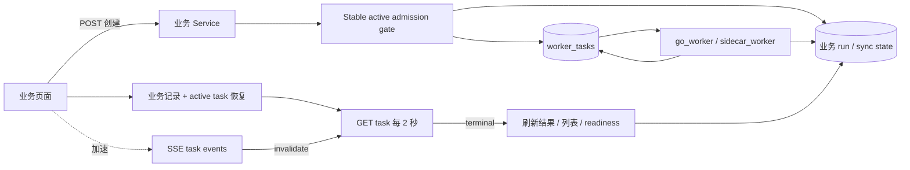

# 异步任务跟踪、刷新恢复与重复创建防护

- 状态：已实施
- 适用范围：全部 `worker_tasks` 业务任务、对应业务页面及管理后台
- 关联架构：`docs/031-unified-worker-task-architecture.md`、`docs/035-worker-task-cancellation.md`
- 数据库影响：无新增结构；复用 `worker_tasks` active dedupe 唯一索引

## 1. 架构结论

异步任务的页面状态不能依赖一次 POST 响应、React 内存状态或 SSE 是否恰好收到事件。系统采用以下固定契约：

1. `GET /api/v1/tasks/{task_id}` 是前端任务状态的正确性来源；active 任务每 2 秒轮询。
2. SSE 只用于降低状态更新延迟。SSE 收到事件后只失效任务查询，不直接覆盖完整任务缓存。
3. 页面加载时先恢复业务范围内的 active 任务，恢复成功前不开放创建按钮。
4. active 的唯一含义是 `pending`、`running`、`pre_complete`；terminal 是 `complete`、`failed`、`canceled`。
5. 同一业务操作最多存在一个 active task。前端禁用按钮改善交互，数据库唯一索引和服务层 admission gate 保证并发正确性。
6. terminal 回调主动失效业务结果、列表和 readiness 查询，用户不需要手工刷新。
7. 刷新、重新进入、跨标签页和 Go 进程短暂重启后的恢复只依赖持久化任务与业务记录。



## 2. 任务盘点与接入

任务类型以 `internal/task/registry.go` 和 `internal/repository/worker_task.go` 为事实来源。

| task type | worker | 创建入口 | 页面跟踪与刷新恢复 | 稳定 active 身份 |
| --- | --- | --- | --- | --- |
| `simulation` | `go_worker` | 模拟与分析、计划创建、改善方案验证 | 分析页按业务 run 与 plan scope 恢复；计划总览支持 URL 提示和 plan scope 恢复 | `simulation|plan:{plan_id}` |
| `stress` | `go_worker` | 模拟与分析 | 按 analysis result 与 plan scope 独立恢复 | `stress|simulation_run:{simulation_run_id}` |
| `sensitivity` | `go_worker` | 模拟与分析 | 按 analysis result 与 plan scope 独立恢复 | `sensitivity|simulation_run:{simulation_run_id}` |
| `fire_plan_improvement` | `go_worker` | FIRE 计划改善器 | 按 improvement run 与 plan scope 恢复 | `fire_plan_improvement|plan:{plan_id}` |
| `research_backtest` | `go_worker` | 组合研究回测 | 集合页按 collection scope 恢复；详情页同时轮询 task 与业务 run | `research_backtest|collection:{collection_id}` |
| `research_optimization_backtest` | `go_worker` | 寻找最优组合 | 集合页按 collection scope 恢复；详情页同时轮询 task 与业务 run | `research_optimization_backtest|collection:{collection_id}` |
| `single_asset_investment_path_backtest` | `go_worker` | 单资产投入路径实验 | 实验列表与结果页按 run/task 恢复 | `single_asset_investment_path_backtest|asset:{asset_key}` |
| `market_data_auto_update_scan` | `go_worker` | Go 定时器 | 自动更新管理页和 worker task 管理页条件刷新 | `market_data_auto_update_scan|system` |
| `asset_directory_sync` | `sidecar_worker` | 资产目录、研究数据面板、自动更新扫描 | 目录 sync state 保存 latest task；创建响应立即进入轮询 | `asset_directory_sync|{sync_key}` |
| `asset_history_sync` | `sidecar_worker` | 资产详情、计划 readiness、研究集合、自动更新扫描 | 资产 history state、研究项状态或 readiness active task 恢复 | `asset_history_sync|{asset_key}|{adjust_policy}|{point_type}` |
| `fx_rate_sync` | `sidecar_worker` | 资产目录、研究/计划缺失数据同步 | 系统 FX sync state 保存 latest task；创建响应立即进入轮询 | `fx_rate_sync|system` |

holding simulation snapshot 构建、task maintenance、finalizer 扫描和 resource TTL 清理不是用户可创建的业务任务，不接入页面任务轮询。

## 3. 状态与 API

### 3.1 公共状态判断

前后端都必须使用公共 helper，不得在页面内重新实现 `pending || running`：

```text
active   = pending | running | pre_complete
terminal = complete | failed | canceled
```

`pre_complete` 表示 sidecar 已提交资源，Go finalizer 正在校验和写入业务数据。此时结果尚不可用，创建按钮必须继续锁定，页面文案显示“正在保存结果”。

### 3.2 公共查询接口

| 方法 | 路径 | 用途 |
| --- | --- | --- |
| `GET` | `/api/v1/tasks/{task_id}` | 获取任务权威快照 |
| `GET` | `/api/v1/tasks` | 按 worker、type、status、scope 和分页查询任务 |
| `POST` | `/api/v1/tasks/{task_id}/cancel` | 请求取消任务 |
| `GET` | `/api/v1/tasks/{task_id}/events` | SSE 状态加速通道 |

列表的 `status=active` 在服务端展开为三个 active 状态。非法 status 返回 `invalid_request`，不能退化为无过滤查询。

公共 task projection 不暴露 payload、claim token 或 worker ownership credential。业务页面恢复 active 任务时至少指定：

```text
worker_type + type + status=active + scope_type + scope_id
```

### 3.3 SSE 契约

SSE handler 按以下顺序执行：

1. 先订阅 task event hub；
2. 再读取数据库中的任务快照；
3. 立即发送当前快照并 `Flush`；
4. 当前快照已经 terminal 时发送后关闭；
5. active 时继续转发事件，每 15 秒发送 keepalive comment；
6. 发送 terminal event 后关闭。

先订阅再读取把状态切换竞态转换为“可能收到重复事件”，而不会丢失状态。前端 terminal 回调按 `task_id + status` 去重，因此重复事件不会重复执行结果失效逻辑。

## 4. 后端创建与并发去重

### 4.1 Admission gate

业务 producer 在同一事务内完成：

1. 按 `worker_type + type + stable dedupe_key` 查询 active task；
2. active task 的 `input_hash` 相同，返回原 task 和业务 run，响应标记 `reused=true`；
3. active task 的 `input_hash` 不同，返回 HTTP 409 `task_already_active`；
4. 不存在 active task 时创建 task 和 pending 业务记录；
5. 并发插入命中 active unique index 时重新读取胜出的任务，再按相同/不同 input 处理。

冲突 details 包含 `task_id`、`task_type`、`scope_type`、`scope_id`，存在业务 run 时包含 `resource_id`。前端据此接管已存在任务或跳转到已存在的业务结果。

稳定 dedupe key 只描述业务操作范围，不包含输入 hash。输入变化只影响 `input_hash`，不能绕过单 active 限制。

### 4.2 自动更新扫描

自动更新扫描的业务身份固定为系统级。调度器时间槽仍使用 idempotency key 防止同一槽重复 enqueue；若上一槽扫描仍 active，新槽直接跳过，不为同一 task 绑定第二个 idempotency key，也不创建重叠扫描。

### 4.3 资产同步

- 目录同步以 sync unit 为粒度；相同 `force` 输入复用 active task，不同输入在 active 期间返回冲突。
- 历史同步的身份包含资产和历史维度，刷新模式等执行输入进入 input hash。
- FX 是系统级任务；所有入口接管同一个 active task。
- 创建或复用 task 与 `last_task_id`/自动更新 rule 绑定在同一事务提交。

## 5. 前端公共层

### 5.1 `useTaskStatus`

`web/hooks/useTaskStatus.ts` 提供统一任务跟踪：

- 有 task id 时立即执行 GET；
- active 时每 2 秒 GET，浏览器后台暂停定时轮询；
- GET 失败保留最后成功快照，并每 5 秒重试；
- 窗口重新聚焦或网络恢复时立即刷新；
- active 时同时建立 SSE，SSE event 只触发对应 task query invalidation；
- terminal 停止轮询和 SSE，并且每个 terminal 状态只调用一次回调；
- `task_not_found` 会失效 active restore query，由业务范围恢复兜底；
- 返回 `pollError`、`notFound`、`isActive`、进度和显式 `refetch`，页面可以展示可恢复错误。

创建 API 返回的 task 快照必须立即作为 `initialTask` 交给 hook，避免 POST 已成功但第一次 GET 尚未返回时按钮短暂恢复可用。

### 5.2 `useActiveTaskRestore`

`web/hooks/useActiveTaskRestore.ts` 按固定顺序恢复：

1. 业务记录中的 task id；
2. 当前会话或 URL 中的 preferred task id；
3. 按完整 scope 查询 `status=active` 的任务列表。

候选 task 必须重新 GET 且仍为 active 才能用于创建门禁。候选 404 时继续下一层；网络或服务错误不能被当作“无任务”，页面保持创建禁用并显示重试入口。

页面计算当前 task id 时直接合并本地创建响应、恢复结果和业务记录，不得等待 effect 把恢复结果复制到另一份 state 后才锁定按钮。

### 5.3 创建冲突

所有手工创建入口采用相同处理：

- 相同输入被服务端复用时直接跟踪返回的 task；
- `task_already_active` 时读取 details 中的 task id，并接管现有任务；
- 研究回测/寻优存在 resource id 时跳转到现有详情；
- 页面显示“已有任务正在执行，已继续跟踪该任务”，不把冲突误报为普通失败。

## 6. 页面行为

### 6.1 模拟、分析与改善器

- simulation、stress、sensitivity 分别恢复和跟踪，互不覆盖 task id 或错误状态。
- 分析页初始业务查询或 scope 恢复未完成时，对应创建按钮保持禁用。
- 计划总览即使没有 `task_id` query 也按 plan scope 恢复 active simulation；带 task id 时还可展示该任务的 terminal 成功或失败反馈。
- FIRE 改善器同时轮询 task、run list 和 active run detail；terminal 后刷新 run、readiness 和计划相关结果。
- 失败或取消清除活动门禁，但保留可理解的业务错误和重试入口。

### 6.2 组合研究

- 集合页分别恢复 backtest 与 optimization，恢复期间禁用对应创建入口。
- 创建成功跳详情页；冲突则跳到服务端返回的现有 run。
- 回测和寻优详情页在 active 时同时轮询业务 run 与公共 task，terminal 后失效集合、run 和 latest 结果。
- research 首页、集合页和最近任务列表在存在 active 记录时条件轮询。
- 数据状态面板的目录、历史和 FX 同步各自跟踪；批量任务部分失败不阻止成功项刷新。

### 6.3 资产与管理后台

- 目录每个 sync unit 独立轮询，创建响应立即更新 unit 与汇总状态；刷新后从 sync state 的 latest task 恢复。
- 资产详情历史同步和系统 FX 同步都保留创建返回的完整 task 快照，terminal 后刷新业务数据。
- `SimulationReadinessPanel` 继续以业务 readiness 为聚合来源，在存在 active history task 时条件轮询。
- 自动更新管理页在 scan 或 rule task active 时提高刷新频率；worker task 列表和抽屉把 `pre_complete` 当作 active。
- 未产生 `result_key` 的 pending/running 任务详情不渲染结果链接。

## 7. Terminal 失效原则

进入 terminal 后至少刷新任务所属业务记录。`complete` 还必须刷新结果消费方；`failed/canceled` 必须刷新列表、错误和创建门禁。

| 任务 | terminal 后主要失效内容 |
| --- | --- |
| simulation | simulations、dashboard、overview、readiness |
| stress / sensitivity | 对应 analysis list/detail、dashboard |
| fire plan improvement | improvement list/detail、readiness、active restore |
| research backtest / optimization | collection、run/optimization detail、research lists |
| directory / history / FX | sync state、资产详情、研究 readiness/metrics、计划 readiness |
| auto update scan | rules、scan task、worker task 列表 |

回调必须使用闭包中的 task/run/scope 身份，不能依赖 terminal 同时被清空的临时 state。

## 8. 故障与恢复语义

- SSE 断开、静默或丢事件：HTTP 轮询继续收敛。
- task GET 临时失败：保留最后快照和按钮锁定，展示“状态更新暂时失败，正在重试”。
- active restore 失败：禁止创建，展示显式重试；不能把异常解释为“当前无任务”。
- task 404：按业务记录和 scope 重新恢复；确认不存在 active task 后才解除本地过期 ID 的门禁。
- 页面刷新：先展示恢复状态，再恢复相同 task；不得产生新的创建 POST。
- 多标签页并发创建：服务端只保留一个 active task，未胜出的页面复用或接管胜出任务。
- Go 进程重启：前端轮询短时失败并自动重试，worker maintenance 恢复任务后继续跟踪至 terminal。

## 9. 验证流程

### 9.1 公共协议

1. 对全部注册任务类型验证 `active` 查询包含 `pending/running/pre_complete`。
2. 验证 SSE 首帧是数据库当前快照、terminal 首帧后关闭、active 连接有 keepalive。
3. 保持 SSE 连接但不发送事件，确认 HTTP GET 仍按周期发生并最终进入 terminal。
4. 让 GET 短暂失败，确认最后状态不消失、按钮不解锁、恢复后自动收敛。

### 9.2 刷新与创建门禁

对 simulation、stress、sensitivity、improvement、backtest、optimization、directory、history 和 FX 分别执行：

1. 创建任务并确认页面立即显示 pending；
2. 在 pending、running、pre_complete 阶段刷新；
3. 确认页面先恢复同一 task id，创建按钮始终不可用；
4. 确认 Network 中没有额外创建 POST；
5. 等待 terminal，确认结果或错误自动出现且按钮状态正确。

### 9.3 并发去重

1. 对每个 stable dedupe key 并发提交两个相同输入；只能创建一个 task，另一个响应复用同一 task。
2. active 期间提交不同输入；必须返回 409 和现有 task identity。
3. 两个标签页最终跟踪同一 task，terminal 后展示一致结果。
4. 自动更新跨两个 scheduler slot 重叠触发时，只允许一个 active scan。

### 9.4 数据库与工程门禁

- schema 基线必须可应用到空数据库，`PRAGMA foreign_key_check` 无结果；
- `migrations/0001_init.sql` 不得包含 DML；
- Go service/API、worker task 协议和并发测试必须通过；
- Web hook、页面恢复、创建门禁、terminal 失效测试必须通过；
- lint、TypeScript 和生产构建必须通过。

## 10. 扩展约束

新增异步任务时必须同时完成：

1. 在 task registry 注册 worker/type 和 processor；
2. 定义 scope、稳定 dedupe key 与完整 input hash；
3. 创建 task 与 pending 业务记录原子提交；
4. 提供业务 task id 或可按 scope 恢复的 active 查询；
5. 使用公共 active/terminal helper、`useTaskStatus` 和 `useActiveTaskRestore`；
6. 恢复完成前锁定创建，处理 `task_already_active`；
7. 定义 terminal 后需要失效的业务查询；
8. 补齐静默 SSE、刷新恢复、并发去重和失败恢复验证。

不得新增只保存 task id 到组件 state、只监听 SSE、只轮询业务 run 而不处理 `pre_complete`，或依靠前端按钮保证唯一性的任务入口。
