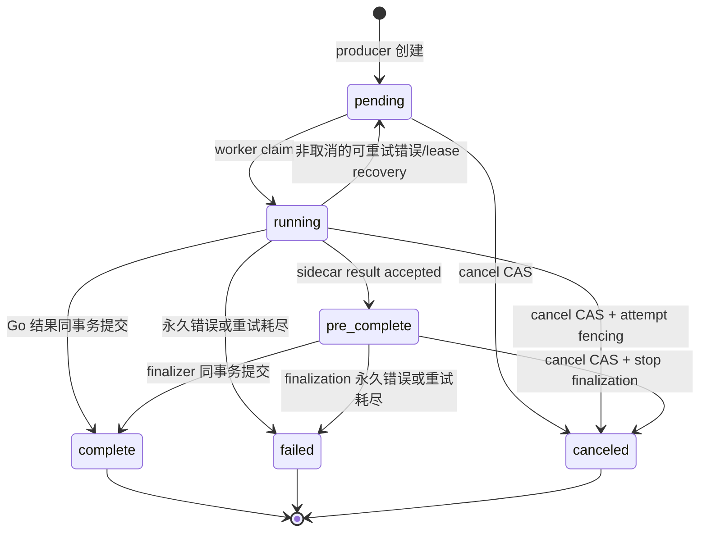
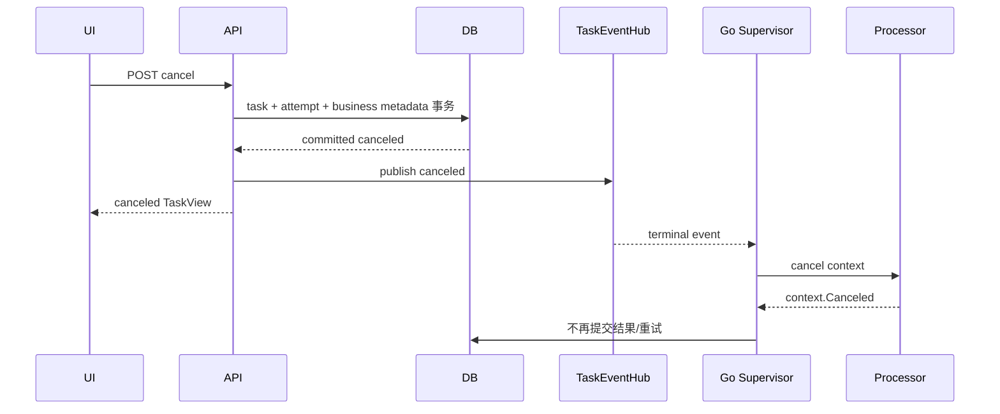
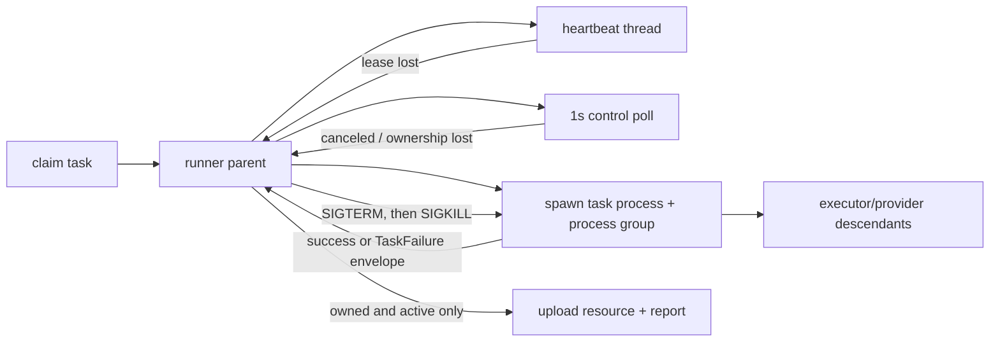

# Worker Task 取消与执行中断

本文描述 `worker_tasks` 的统一取消协议、Go worker 与 market-provider sidecar 的执行中断机制，以及业务页面和管理后台的取消入口。任务创建、领取、心跳、结果提交等基础协议见 `031-unified-worker-task-architecture.md`；页面恢复与轮询见 `034-async-task-tracking-and-recovery.md`。

## 1. 适用范围

取消协议覆盖当前注册的全部任务类型：

| worker | task type | 业务用途 |
| --- | --- | --- |
| `go_worker` | `simulation` | FIRE Monte Carlo 模拟 |
| `go_worker` | `stress` | 压力测试 |
| `go_worker` | `sensitivity` | 敏感性分析 |
| `go_worker` | `fire_plan_improvement` | FIRE 计划改善器 |
| `go_worker` | `research_backtest` | 组合研究回测 |
| `go_worker` | `research_optimization_backtest` | 组合寻优回测 |
| `go_worker` | `market_data_auto_update_scan` | 自动更新规则扫描 |
| `sidecar_worker` | `asset_directory_sync` | 资产目录同步 |
| `sidecar_worker` | `asset_history_sync` | 资产历史同步 |
| `sidecar_worker` | `fx_rate_sync` | 汇率同步 |

`TaskCancellationService` 在启动时校验 cancellation handler registry。新增 task type 时，即使不需要业务表收尾，也必须显式注册 no-op handler；遗漏会阻止应用启动。

## 2. 固定语义

1. `pending`、`running`、`pre_complete` 均可取消。
2. 取消 API 成功返回前，任务已持久化为 `canceled`，不保留长期的 `running + cancel_requested` 中间状态。
3. `canceled` 是不可逆终态，不能 claim、finalize、retry、resume，也没有恢复接口。
4. 取消事务立即释放 active dedupe。重新运行会创建新的 task id、run id、input snapshot 和 claim token。
5. 数据库终态和本地执行停止是两层保证：控制面先用状态与 claim token 隔离旧 worker，worker 再停止 CPU、goroutine、网络请求或子进程。
6. 已取消任务不保存部分计算结果，不覆盖最近成功数据，也不计入失败告警。
7. 停用自动更新规则只影响未来调度，不取消已创建任务；停止当前任务使用独立的“取消本次任务”。
8. 取消自动更新 scan 不级联取消已经创建的同步任务；取消单个同步任务也不影响其他同步单元。

## 3. 状态机

`cancel_requested=1` 是取消终态的审计标记。claim、maintenance recovery 和 finalizer 均只处理 active 状态，因而不会重新处理 `canceled`。

## 4. 控制面事务

### 4.1 统一入口

普通页面和管理后台分别调用：

| 方法 | 路径 | 来源 |
| --- | --- | --- |
| `POST` | `/api/v1/tasks/{task_id}/cancel` | 普通业务页面 |
| `POST` | `/api/v1/admin/worker-tasks/{task_id}/cancel` | 管理后台 |

两个接口都委托 `TaskCancellationService.Cancel`，前端不能提交自定义 reason，也不能直接更新任务表。

错误契约：

- task 不存在：404 `task_not_found`；
- task 已 `complete` 或 `failed`：409 `task_already_terminal`，details 包含当前 status；
- task 已 `canceled`：幂等返回 200 和当前 task；
- active task：返回取消后的公共 `TaskView`。

取消来源使用稳定错误码：

| 来源 | error code | message |
| --- | --- | --- |
| 普通页面 | `canceled_by_user` | `task canceled by user` |
| 管理后台 | `canceled_by_admin` | `task canceled by administrator` |
| 新分析替代旧分析 | `superseded_by_newer_analysis` | `superseded by a newer analysis run` |
| 删除计划 | `canceled_by_plan_delete` | `plan deleted` |

### 4.2 `CancelImmediateTx`

`Coordinator.CancelImmediateTx` 在调用方事务内完成：

1. 读取 task 并判断幂等或终态冲突；
2. 将 active task 更新为 `canceled`，写入 `cancel_requested=1`、`finished_at` 和取消原因；
3. 清空 `next_finalize_at`、owner、claim token、heartbeat 和 lease；
4. 保留 `started_at`、最后进度、phase 和已接收的 result key，供审计使用；
5. running task 的当前 open attempt 写入 `released_at`、`outcome=canceled`、`report_outcome=canceled` 和相同错误；
6. pre-complete attempt 保留 `result_accepted` 事实，只停止 task 和 finalization；
7. 执行 task type 对应的业务终态 handler；
8. 事务提交后发布 terminal task event。

active 唯一索引只覆盖 `pending/running/pre_complete`。因此取消事务一旦提交，相同 dedupe key 可以绑定新的 task；旧 worker 的 token 对旧任务和新任务都无写入权限。

### 4.3 业务终态 handler

| task type | 取消时的业务表动作 |
| --- | --- |
| `fire_plan_improvement` | 按 task id 设置 improvement run 的 `completed_at` |
| `research_backtest` | 按 task id 设置 backtest run 的 `completed_at` |
| `research_optimization_backtest` | 按 task id 设置 optimization run 的 `completed_at` |
| 其他类型 | 显式 no-op；生命周期由 task join 提供，或不存在待收尾业务记录 |

这些更新与 task 终态位于同一事务。取消先提交时，旧 worker 的业务结果事务会因 completion CAS 失败而整体回滚；完成先提交时，取消接口返回 409，不改写成功结果。

### 4.4 删除操作

- 删除 plan 会在同一事务中取消该 plan scope 下全部 active Go task，再删除 plan；共享的市场同步任务不随 plan 删除。
- `hard=true` 删除研究集合时，先取消 collection scope 下的 active 回测和寻优任务，再级联删除集合与运行记录。
- 归档研究集合不取消已基于冻结输入运行的任务。
- 删除事务提交后发布对应 task event。

## 5. Go Worker 中断

### 5.1 通知与兜底

Supervisor claim 成功后、执行 processor 前订阅该 task 的 `EventHub`，并立即读取一次权威快照，消除 claim 与订阅之间的竞态。

- canceled event 会设置 `cancelRequested` 并取消 attempt context；
- 其他 terminal event 会停止已失去意义的本地执行；
- heartbeat 返回 lease lost 时同样取消 context，作为事件丢失的兜底；
- processor 返回后会停止并等待 event watcher 与 heartbeat goroutine，避免泄漏；
- 进程 shutdown 仍走 release/retry，不会伪装成人工取消。

### 5.2 Processor 检查点

| processor | 中断边界 |
| --- | --- |
| simulation | 每条 path 前；取消后不执行排序、分位数和代表路径聚合 |
| stress | baseline、scenario、每条 path 和聚合前；返回 `context.Canceled`，不返回部分 report |
| sensitivity | baseline、perturbation、heatmap cell 和聚合前；不返回部分 report |
| improvement | context 贯穿 search、候选评估和模拟；等待并发评估退出 |
| research backtest | series 准备、FX/资产准备、逐交易日、再平衡和指标聚合 |
| research optimization | 候选生成与每个候选回测共用取消信号；即使候选已生成完，in-flight 单候选仍可停止 |
| auto update scan | reconcile、batch、rule、enqueue 前后；取消不写规则失败 |

纯计算函数使用显式 canceled result 或 `context.Canceled`，processor 在序列化和写库前再次检查取消。

## 6. Sidecar 强制中断

AKShare、TickFlow 和 HTTP provider 可能阻塞于不支持 context 的调用。仅设置线程事件不能及时停止这些调用，因此每个 claimed sidecar task 在独立的非 daemon 进程组中执行。

固定行为：

- child 建立新 process group 后执行统一 `execute_task`；其后代继承该 group；
- child 仅通过 queue 返回 dict、`TaskFailure` envelope 或 internal error；
- parent 每 200ms 检查 result、cancel、lease lost 和 shutdown；
- `FIREMAN_WORKER_CANCEL_POLL_INTERVAL` 控制权威 task 查询周期，默认 1 秒；
- cancel/lease lost 时先向整个 group 发送 SIGTERM，等待后再 SIGKILL，并 join；
- canceled task 不 upload、不 report success/failed，也不触发 retry；
- lease lost 丢弃结果；worker shutdown 在仍持有 lease 时 release，使任务按非取消规则恢复；
- 临时控制面读取失败只记录 warning，heartbeat 继续维持 lease，不会误取消。

该执行模型面向当前 Linux sidecar 容器。

## 7. 前端交互

`TaskCancelButton` 与 `useCancelTask` 是统一入口：

- 仅 active task 显示“取消任务”；自动更新规则使用更具体的“取消本次任务”；
- 点击后使用 danger `ConfirmDialog`，请求期间禁用并显示“取消中…”；
- pending、running、pre-complete 使用不同确认文案；共享同步任务额外提示可能影响其他等待页面；
- 成功后写入 task query cache，失效 active task restore，并由调用页面刷新业务 query；
- 409 terminal race 会读取权威 task、关闭确认框并显示“任务已结束，无法取消”；
- 网络错误保留确认框和错误信息，可重试，不在本地伪造 canceled；
- 页面刷新或重新进入后，通过业务记录或 scope 恢复 active task，仍能取消且不会重复创建任务。

取消入口：

| 场景 | 入口 |
| --- | --- |
| simulation / stress / sensitivity | 模拟与分析；overview 的 active simulation 提示 |
| FIRE 改善器 | 改善器 active 状态区 |
| research backtest / optimization | 集合页运行区和运行详情页 |
| directory / FX sync | 资产目录的具体 active 单元 |
| asset history sync | 资产详情“刷新历史数据”旁 |
| research asset/FX sync | 数据状态列表的具体 active task |
| missing history sync | simulation readiness 展开的 active task 列表 |
| auto update rule task | 自动更新管理的“取消本次任务” |
| 全部 task | 管理后台任务表格操作列和详情 drawer |

市场资产选择弹窗、计划导航和 dashboard 的非运行提示不重复提供取消操作。历史 task 详情不提供恢复原任务；重新运行始终创建新任务。

## 8. 自动更新语义

1. Reconcile 和 `enabled=failed` 只把 `worker_tasks.status=failed` 视为失败。
2. canceled task 在管理页显示“最近任务已取消”，不更新 `last_failed_at` 和 `last_error_*`。
3. 取消当前 rule task 不修改 rule 的 enabled、interval 或 `next_run_at`。
4. 当前 task 创建时已推进 `next_run_at`；取消后等待下一正常周期，不补跑同一周期。
5. 停用 rule 不取消当前 task；“取消本次任务”也不停用 rule。
6. scan 取消后，已创建的 child task 继续执行；下一扫描时隙仍可创建新 scan。

## 9. 一致性与资源

- canceled 模拟、分析、改善器和研究任务不写部分业务结果。
- sidecar 在 upload 前取消时不产生 resource；upload 后、report 前取消时 resource 不会进入 finalization，按 resource DB TTL 清理。
- pre-complete 取消保留 result key 和 `result_accepted` attempt 审计，但 finalizer 不再 reserve task。
- 已成功 finalization 的业务数据不会被后到的取消删除。
- 新任务不共享旧 task 的 attempt、token、run 或结果。

## 10. 代码位置

| 职责 | 主要位置 |
| --- | --- |
| 状态机与 attempt fencing | `internal/task/coordinator.go` |
| task type 完整性 registry | `internal/task/registry.go` |
| 统一取消服务 | `internal/service/task_cancellation_service.go` |
| public/admin API | `internal/service/task_service.go`、`internal/api/*handlers.go` |
| 业务 completed metadata | `internal/repository/research.go`、`fire_plan_improvement.go` |
| Go supervisor | `internal/worker/supervisor.go` |
| Go processors 与计算循环 | `internal/worker/processors.go`、`internal/simulation`、`internal/stress`、`internal/sensitivity`、research services |
| Sidecar control/process | `sidecars/market-provider/fireman_market_provider/worker/runner.py`、`process_runner.py` |
| 公共前端能力 | `web/hooks/useCancelTask.ts`、`web/components/ui/TaskCancelButton.tsx` |

## 11. 回归验证要求

后续修改任务框架、processor 或取消入口时，至少保持以下验证：

1. pending/running/pre-complete 取消均立即进入 terminal；canceled 幂等，complete/failed 冲突。
2. running attempt 被关闭，旧 heartbeat/upload/report/complete token 全部失效。
3. pre-complete task 不再被 finalizer reserve，已接收 attempt 不被篡改。
4. 取消后相同 dedupe key 可创建新 task，旧 task 不 retry/resume。
5. cancel/complete 和 cancel/finalize 并发只有一个事务获胜。
6. 三类业务 run 的 `completed_at` 与 task 终态同步。
7. 每类 Go processor 在关键阶段取消时返回空结果或 `context.Canceled`，不写部分结果；寻优覆盖 in-flight 单候选。
8. Sidecar cancel、lease lost、shutdown 均终止 parent/child/grandchild，且取消分支不 upload/report failed。
9. 自动更新 canceled 不进入 failed 筛选、不改写失败元数据，规则下次时间保持。
10. 前端覆盖确认、pending、错误重试、terminal race、刷新恢复和业务 query 收敛。
11. Go 全量测试与关键并发包 race、Sidecar 全量测试、Web 测试/lint/production build 通过。
12. `migrations/0001_init.sql` 仍可应用到空库，`PRAGMA foreign_key_check` 为空，且 migration 保持单文件 DDL-only。
